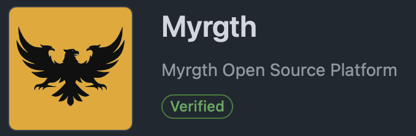

>  We develop software **forever**.  
>  The days of we developed something and we're done and we move on have ended. "Joseph Emison"

### About me!

I'm a Software Engineer with over 10+ years of hands-on experience in creating and maintaining software.

### Public Projects and Repositories

### Skills

* [Java] - Spring | JEE
* [JavaScript] - jQuery | ReactJS
* [Containers] - Docker | Swarm | Amazon ECS | Kubernetes | Amazon EKS
* [Messaging] - Amazon SQS | Amazon SNS | RabbitMQ | Kafka
* [Microservices] - Netflix OSS | Spring Cloud
* [CI | CD] - Atlassian | Jenkins | Travis | GitHub Actions
* [PaaS | IaaS] - AWS | Digital Ocean | Linode | OpenShift | Google Compute Engine
* [IaC] - CloudFormation
* [Amazon] - ECS | EKS | SQS | SNS | CloudFormation | IAM | ACM | S3 | CloudFront |
             ApiGateway | Lambda | Elastic Beanstalk | EC2 | ECR | CloudWatch |
             CodeDeploy | VPC | Subnet | RouteTable | NetworkAcl | SecurityGroup |
             LoadBalancer
* [OS] - Windows | Linux | macOS 
* [Linux] - Ubuntu | Amazon Linux | CentOS | RHEL
* [VCS] - GitHub | Bitbucket | GitLab
* [SQL] - Oracle | MySQL | PostgreSQL | SQL Server
* [NoSQL] - MongoDB
* [HTML] -  4.01+ | 5
* [CSS] - 2.1+
* [PHP] - Yiiframework
* [Paradigms | Frameworks] - Agile | SCRUM | DevOps | Kanban | XP | Spiral | RUP | Waterfall
* [Servers] - Nginx | Jetty | NodeJS | Apache2 | Jboss and Sons | WebSphere | Weblogic

### Community

Want to contribute? Great!  
Can I contribute? Ask me!
